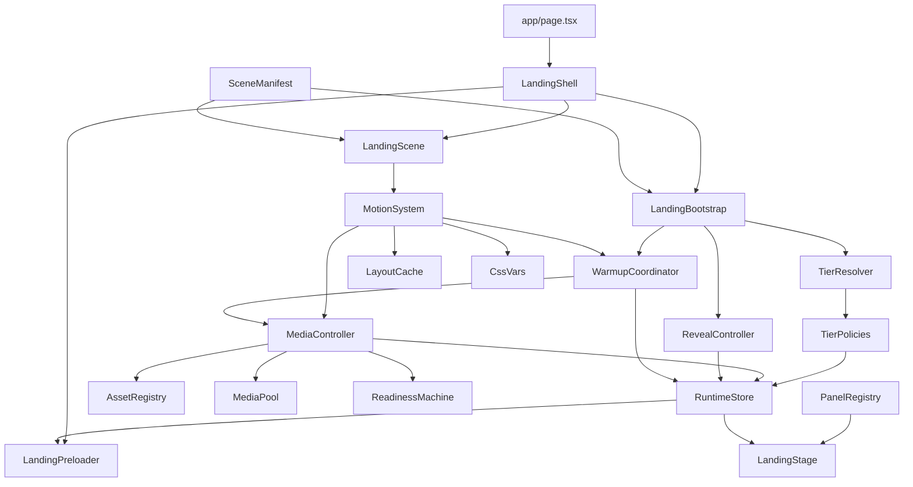
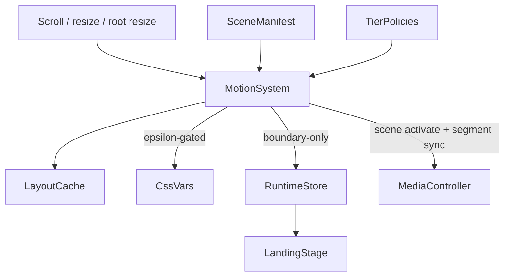
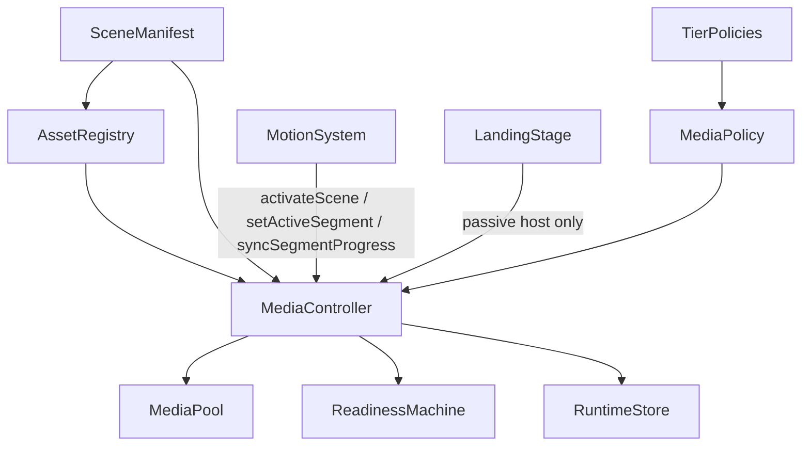

# Landing Architecture Overview

## Goal

Phase 1 replaced the old component-driven landing foundation with a manifest-driven runtime skeleton.
Phase 2 established the deterministic motion engine.
Phase 3 adds the production media runtime that now integrates with that motion stack without moving playback control into React.
Phase 4 adds a production reveal pipeline, staged warmup coordinator, and coarse preloader contract that only reveals the landing once the initial visual state is actually ready for the current tier.
Phase 5 adds the stage-local visual runtime for lazy panel lifecycle, CSS-variable-driven choreography, tier-aware glass surfaces, and explicit visual layering.

The active landing path is now:

- `app/page.tsx`
- `components/landing/LandingShell.tsx`
- `components/landing/LandingScene.tsx`
- `components/landing/LandingStage.tsx`
- `lib/landing/runtime/landingBootstrap.ts`

The old `components/homepage` and `components/sections` stack is no longer the active route foundation.

## New Module Map

### `lib/landing/core`

- `contracts.ts`
  Shared foundation types for media mode, readiness states, panel keys, preload hints, and warmup hints.
- `assert.ts`
  Small runtime invariant helper for future phases.

### `lib/landing/scenes`

- `sceneTypes.ts`
  Typed contract for landing segments and the scene manifest.
- `sceneManifest.ts`
  Declarative source of truth for segment order, lengths, media mapping, preload rules, warmup hints, tier compatibility, panel keys, and text choreography hooks.
- `sceneChoreography.ts`
  Helpers for declarative text cue generation.
- `sceneSelectors.ts`
  Selectors for critical segments, active segment lookup, visible neighbor windows, and warmup target resolution.

### `lib/landing/tier`

- `tierTypes.ts`
  Strict tier and policy types.
- `tierResolver.ts`
  Conservative runtime tier selection based on viewport, motion preference, connection, and hardware hints.
- `tierPolicies.ts`
  Mapping from tier snapshot to media policy, motion policy, and performance budget.

### `lib/landing/media`

- `assetRegistry.ts`
  Resolves manifest asset ids into concrete desktop/mobile media records, effective media modes, preload targets, and warmup targets.
- `mediaPolicy.ts`
  Resolves effective media behavior per tier, preload targets, standby eligibility, and scrub throttling settings.
- `mediaPool.ts`
  Manages active and standby video planes so the controller can reuse media elements and limit decoder churn.
- `readinessMachine.ts`
  Explicit readiness state transitions, comparisons, and unlock checks.
- `mediaController.ts`
  Central media pipeline for critical preload, incremental warmup, pooled video lifecycle ownership, poster fallback, and deterministic segment-driven playback updates.
- `mediaManifest.ts`
  Legacy adapter around the canonical asset inventory retained for compatibility during the rebuild.

### `lib/landing/runtime`

- `runtimeTypes.ts`
  Typed runtime state shape.
- `runtimeStore.ts`
  External store with coarse-grained snapshot access for React.
- `progressMath.ts`
  Pure helper utilities for manifest range normalization and clamped progress math.
- `sceneRegistry.ts`
  Pure scene measurement/progress helper layer retained for non-owning runtime math reuse.
- `motionSystem.ts`
  The single production motion runtime. It owns passive scroll scheduling, `requestAnimationFrame`, resize invalidation, hysteresis-protected segment activation, CSS variable writes, and delegated media synchronization.
- `revealController.ts`
  Coarse reveal state machine that waits for tier resolution, motion readiness, critical asset readiness, and bootstrap completion before allowing the shell to reveal.
- `warmupCoordinator.ts`
  Staged warmup orchestrator for critical, near-future, and background assets. It keeps scheduling policy in the runtime layer while delegating actual preload ownership to `mediaController.ts`.
- `landingBootstrap.ts`
  Bootstraps tier resolution, policy setup, reveal orchestration, and initial warmup sequencing.

### `components/landing`

- `LandingShell.tsx`
  Route-scoped orchestration shell.
- `LandingScene.tsx`
  Mounts the scroll scene root and attaches the stage to the runtime bootstrap.
- `LandingStage.tsx`
  Renders the sticky poster layer plus a passive media host while consuming coarse runtime snapshots. Panel residency is driven by `motionPolicy.mountStrategy`.
- `LandingPreloader.tsx`
  Route-scoped staged preloader that reflects coarse reveal state, progress milestones, and poster fallback status.
- `panels/LandingSurface.tsx`
  Lightweight panel surface wrapper that now delegates to the landing-native glass runtime.
- `panels/LandingPanelFrame.tsx`
  Panel lifecycle wrapper that applies residency state, accessibility gating, and segment-local CSS variable wiring.
- `panels/panelRegistry.tsx`
  Lazy panel registry that maps declarative `panelKey` values to on-demand UI modules.
- `panels/*.tsx`
  Route-local panel modules split by panel key so only nearby panels load their heavy UI.
- `ui/GlassPanel.tsx`
  Tier-aware landing glass primitives for panel surfaces, supporting cards, and decorative overlays.

## Data Flow

## Landing Bootstrap Process

Bootstrap now lives in `lib/landing/runtime/landingBootstrap.ts` and runs in this order:

1. create the external runtime store
2. create `mediaController.ts`, `revealController.ts`, and `warmupCoordinator.ts`
3. start reveal initialization in the coarse runtime store
4. resolve the tier snapshot through `tierResolver.ts`
5. map the tier into `mediaPolicy`, `motionPolicy`, and `performanceBudget`
6. write the coarse runtime snapshot into the store
7. resolve the initial manifest segment and activate it inside the media controller
8. define the reveal-critical asset set for the first segment
9. load those reveal-critical assets through `warmupCoordinator.ts`
10. wait for motion readiness, tier resolution, bootstrap completion, and critical asset readiness
11. move the reveal state from `critical-loading` to `ready-to-reveal` to `revealed`
12. schedule near-future and background warmups after the initial reveal is safe

The shell still triggers bootstrap initialization, but the bootstrap now owns the reveal handoff instead of equating media preload completion with shell visibility.

## Scene Manifest Contract

Each segment in `lib/landing/scenes/sceneManifest.ts` declares:

- `id`
- `lengthVh`
- `media.assetId`
- `media.posterAssetId`
- `media.mode`
- `preloadHint`
- `warmupHint`
- `tierCompatibility`
- `textChoreography`
- `panelKey`
- `theme`
- `motionPreset`

This replaces the old pattern where segment timing, media choice, preload behavior, and panel JSX were mixed inside `components/sections/scrollStorySegments.tsx`.

Panel sequencing now comes from the manifest plus the panel registry. React renders panel components selected by `panelKey`; it does not define the sequence itself.

## Runtime Store Contract

The external runtime store keeps only coarse-grained state:

- `tierSnapshot`
- `performanceBudget`
- `mediaPolicy`
- `motionPolicy`
- `readiness.bootstrap`
- `readiness.bootstrapPhase`
- `readiness.revealState`
- `readiness.unlockTarget`
- `readiness.criticalReadyState`
- `readiness.activeAssetReadyState`
- `readiness.motionReady`
- `readiness.tierResolved`
- `readiness.fallbackMode`
- `preloader.stage`
- `preloader.progress`
- `warmup.stage`
- `warmup.critical`
- `warmup.nearFuture`
- `warmup.background`
- `motion.activeSceneId`
- `motion.activeSegmentId`
- `media.activeAssetId`
- `media.activePosterSrc`
- `media.assetReadiness`

Hot path motion and media updates stay imperative inside the motion and media systems instead of flowing through React context.
React subscribes through `useSyncExternalStore` selectors and does not receive frame telemetry state, live document progress, or per-segment motion progress.
The preloader and shell only observe coarse reveal milestones, so React remains outside the animation and decode hot paths.

## Motion System

The motion system now:

- owns the only passive scroll listener and the only `requestAnimationFrame` queue
- measures layout only on invalidation through resize, orientation, and root resize signals
- computes document, scene, and segment progress from manifest ranges and cached layout
- uses hysteresis to stabilize active segment switching at scene boundaries
- writes root and active-window segment CSS variables imperatively with epsilon-gated updates
- updates the runtime store only for scene and segment boundary changes
- feeds tier-approved scrub progress directly into the media controller
- triggers manifest-defined warmup targets from the runtime layer only on boundary changes
- keeps React out of frame-by-frame progress handling

`scrollEngine.ts` is no longer a runtime owner. The motion kernel now lives directly in `motionSystem.ts`.

## Motion Flow

## Scene Activation Model

The engine keeps its own mutable scene and segment state outside React.

Per frame, it:

1. reads the current scroll position
2. remeasures cached boundaries only if layout is dirty
3. computes normalized scene progress from the manifest-defined scroll span
4. resolves the active segment with hysteresis instead of switching exactly on raw boundaries
5. writes CSS variables only for the active segment and the near-active mount window
6. emits coarse store updates only when scene or segment boundaries actually change

Resize and orientation invalidation trigger a full recompute and resync of:

- scene activation
- active segment selection
- CSS custom properties
- delegated media progress

## Media Pipeline

The media controller is the new single media orchestrator for the landing stage.

Responsibilities:

- own all `HTMLMediaElement` instances
- resolve the effective media mode from tier policy and manifest metadata
- keep a stable active asset identity and poster identity
- avoid resetting `video.src` unless the resolved asset actually changes
- preload critical assets from manifest hints and unlock only when required readiness is satisfied
- warm adjacent and deferred assets incrementally under budget limits
- reuse active and standby video planes through `mediaPool.ts`
- report explicit readiness states and degrade to hold or poster on failure

The landing shell no longer decides when media warms; warmup decisions are executed inside the runtime/motion/media stack.

## Media Runtime Architecture

`mediaController.ts` is now the only runtime owner of media elements and playback state. React renders a passive host container in `LandingStage.tsx`, but the controller creates, mounts, reuses, and tears down video nodes independently from the React lifecycle.

`assetRegistry.ts` is the bridge from `sceneManifest.ts` to concrete media delivery. It resolves:

- active asset id
- poster asset id
- effective media mode after tier rules
- preload target readiness
- warmup targets
- concrete desktop/mobile sources from `lib/landing/mediaManifest.ts`

`mediaPool.ts` maintains a small number of reusable video planes:

- one active plane for the currently visible cinematic asset
- an optional standby plane for near-future warmups on higher tiers
- bounded reuse based on `standbyPoolSize` and `maxActiveVideos`

`readinessMachine.ts` remains the canonical readiness ladder:

- `idle`
- `poster-ready`
- `metadata-ready`
- `first-frame-ready`
- `playable`
- `failed`

Bootstrap and preloader logic now rely on these explicit states instead of incidental component timing.

## Reveal Pipeline

Phase 4 adds a dedicated reveal controller instead of letting binary bootstrap readiness hide or show the shell directly.

The reveal contract is:

1. tier must be resolved
2. motion must mount and write its initial boundary state
3. runtime bootstrap must finish initializing policies and initial media activation
4. reveal-critical assets for the first segment must satisfy the tier-specific unlock target
5. if that readiness cannot be reached safely, the runtime must downgrade to poster fallback before reveal

The reveal state machine is:

- `boot`
- `initializing`
- `critical-loading`
- `ready-to-reveal`
- `revealed`
- `failed`

`revealController.ts` keeps those transitions coarse and deterministic. It watches the store, derives aggregate critical readiness, detects stalled critical loading, and only advances the shell once the required first-scene visual state is ready.

## Preloader Contract

`LandingPreloader.tsx` remains route-scoped inside `LandingShell.tsx`, but it now reflects coarse reveal state instead of a binary `ready` flag.

The preloader reads:

- `readiness.revealState`
- `readiness.fallbackMode`
- `readiness.unlockTarget`
- `preloader.stage`
- `preloader.progress`

Progress is milestone-based rather than timer-based:

- tier resolution contributes the first milestone
- motion readiness contributes the next milestone
- bootstrap completion contributes another coarse step
- critical asset readiness advances progress according to the current tier target
- the reveal handoff contributes the final transition to `revealed`

The scene still mounts behind the preloader overlay, so the handoff is a fade-out rather than a conditional React mount.

## Warmup Strategy

Phase 4 moves warmup sequencing into `warmupCoordinator.ts`.

Warmup stages are:

- `critical-assets`
- `near-future-assets`
- `background-assets`

Responsibilities:

- define reveal-critical requests from the first manifest segment plus tier policy
- warm after-critical and on-enter targets from manifest `warmupHint.when`
- schedule background requests after near-future warmup is queued
- keep only coarse warmup bucket summaries in the runtime store
- leave actual media element and preload ownership inside `mediaController.ts`

This closes the earlier gap where `warmupHint.when` existed in the manifest but the runtime always treated warmups as generic bootstrap or boundary side effects.

## Tier Resolution Flow

Tier resolution is independent from React:

1. `tierResolver.ts` reads viewport and platform hints
2. it emits a conservative `tierSnapshot`
3. `tierPolicies.ts` maps that snapshot into media, motion, and budget policies
4. `landingBootstrap.ts` stores those policies in the external runtime store
5. React reads the resulting coarse snapshot through selectors only

## Media Orchestration Flow

Media orchestration now flows like this:

1. `sceneManifest.ts` declares asset ids, media modes, preload hints, and warmup hints
2. `assetRegistry.ts` resolves the manifest requirements into concrete asset records for the current device profile
3. `mediaPolicy.ts` resolves effective media behavior for the current tier, including scrub throttling and warmup targets
4. `motionSystem.ts` activates scenes and segments and forwards tier-approved scrub progress without touching media elements directly
5. `mediaController.ts` selects the active asset, manages pool reuse, schedules preload work, and drives fallback behavior
6. `readinessMachine.ts` upgrades readiness state explicitly and guards bootstrap unlock
7. `LandingStage.tsx` only reflects the coarse media snapshot from the store while hosting controller-owned media nodes

## Asset Lifecycle

Every cinematic asset now follows this lifecycle:

1. manifest declaration through `sceneManifest.ts`
2. asset resolution in `assetRegistry.ts`
3. reveal-critical, near-future, or background scheduling in `warmupCoordinator.ts`
4. readiness promotion through `readinessMachine.ts`
5. active or standby plane assignment in `mediaPool.ts`
6. playback mode application in `mediaController.ts`
7. downgrade to hold or poster if decode, autoplay, or network behavior is not acceptable

The preloader now unlocks only when the reveal-critical asset set for the first segment satisfies `readiness.unlockTarget`. On premium and balanced tiers that means first-frame readiness; lower tiers can reveal safely at metadata or poster readiness according to `tierPolicies.ts`.

## Scrub Synchronization Model

Scrub playback remains delegated from the motion engine through:

- `activateScene(sceneId)`
- `setActiveSegment(segment)`
- `syncSegmentProgress(sceneId, progress)`

The motion system still owns all scroll activation and progress math. The media controller only consumes those signals and applies them to the active plane.

Scrub safeguards now include:

- progress epsilon checks before accepting a new scrub target
- minimum seek intervals per tier
- current-time epsilon checks before mutating the media element
- `requestVideoFrameCallback` pacing when available
- decode-lag detection with fallback to `hold`
- poster fallback on hard media failure

This keeps scroll scrubbing deterministic while preventing seek storms on mid-tier devices.

## Tier Media Behavior

The media runtime now follows these tier rules:

- `tier-3-premium`: full scrub, first-frame reveal unlock, active plus standby pool, aggressive warmup
- `tier-2-balanced`: scrub with stronger throttling, first-frame reveal unlock, single active plane, adjacent warmup
- `tier-1-hold`: no scrub, hold-mode video, metadata reveal unlock, no standby pool
- `tier-0-poster`: poster-only rendering, poster reveal unlock, no video planes, no warmup

Tier policy still lives in `tierPolicies.ts`, but Phase 4 now applies those constraints directly to reveal and warmup behavior instead of using them only for media mode selection.

## Failure And Recovery

Failure handling now stays deterministic and route-scoped:

- decode, autoplay, or active-plane failures still downgrade the active runtime through `mediaController.ts`
- reveal stalls now trigger poster fallback through `revealController.ts` instead of leaving the overlay pending forever
- if poster-safe readiness still cannot be reached, reveal enters `failed`
- `motionSystem.ts` now re-queues layout and warmup work on `visibilitychange`, `pageshow`, resize, and orientation changes so motion and media can resynchronize after tab resume or viewport changes

## Performance Safeguards

The Phase 4 reveal pipeline is designed to stay off the React hot path and protect decode/network budgets:

- React no longer owns or controls the landing video nodes
- source changes are skipped when the resolved asset is unchanged
- active and standby planes are reused instead of recreated during scroll
- preload work is bounded by `maxConcurrentPreloads`
- active media residency is bounded by `maxActiveVideos`
- reveal state is coarse and event-driven rather than timer-driven
- warmups are staged and triggered from runtime boundaries rather than from component renders
- the preloader reads only coarse store milestones and never subscribes to frame progress
- scrub seeks are throttled and coalesced before writing `currentTime`
- fallback to hold/poster prevents unstable decode loops from stalling the scene runtime

## Phase 4 Implementation Report

### Reveal Architecture

Phase 4 keeps `motionSystem.ts` as the sole animation owner and `mediaController.ts` as the sole media owner, but adds `revealController.ts` as the coarse owner of shell visibility. The shell remains route-scoped, the scene still mounts immediately, and the preloader only fades once tier resolution, motion readiness, bootstrap completion, and first-scene critical readiness all agree.

### Readiness Pipeline

Reveal-critical assets are derived from the first manifest segment plus the current tier policy. Readiness still advances through `poster-ready`, `metadata-ready`, `first-frame-ready`, and `playable`, but the reveal controller now aggregates that readiness into a single coarse `criticalReadyState` and compares it against the tier-specific `unlockTarget`.

### Warmup Orchestration

`warmupCoordinator.ts` now owns staged scheduling:

- first-scene critical requests are loaded for reveal safety
- after-critical assets warm the near-future window
- remaining manifest requests move into background warmup under existing concurrency limits
- on-enter warmups still fire from motion boundaries, but the scheduling policy no longer lives inside `motionSystem.ts`

### Tier Behavior

Premium tiers keep full scrub behavior and first-frame reveal safety. Balanced tiers keep first-frame reveal but tighter decode and warmup budgets. Hold tiers reveal at metadata safety and keep non-scrub cinematic playback. Poster tiers reveal from poster-only assets and skip video warmup entirely.

### Failure Fallback Logic

If critical video readiness fails or stalls, the reveal controller downgrades the reveal contract to poster-safe readiness and asks `mediaController.ts` to enter poster fallback. That lets the landing reveal deterministically without waiting on arbitrary timers. If even poster-safe readiness cannot be reached, the coarse reveal state moves to `failed`.

## Tier System

Supported runtime tiers:

- `tier-0-poster`
- `tier-1-hold`
- `tier-2-balanced`
- `tier-3-premium`

Each tier maps to:

- media policy
- motion policy
- performance budget

The resolver is conservative by default and promotes only when viewport and hardware hints justify it.
Tier resolution happens once during bootstrap and is then exposed through the runtime store.

## Route-Scoped Isolation

The root layout no longer injects landing-specific media preloads or SVG displacement filters.

Global styling has been reduced back to a neutral body background, while landing-specific visuals are now route-scoped inside `components/landing/LandingShell.module.css`.

## Legacy Status

Legacy modules are tracked in `_legacy/landing/README.md`.

Removed stacks:

- `components/homepage/*`
- `components/sections/*`
- `components/motion/ScrollScene.tsx`
- `components/ScrollIndicators.tsx`
- `components/ScrollScrubVideoSection.tsx`
- `components/debug/LandingPerfOverlay.tsx`
- `lib/landing/assetStore.ts`
- `lib/landing/preloadPolicy.ts`
- `lib/landing/runtime/capabilityProfile.ts`
- `lib/landing/runtime/effectsPolicy.ts`
- `lib/landingMedia.ts`

The shared `components/ui/Glass.tsx` component has also been detached from the old landing runtime provider so shared UI no longer imports legacy landing context.

## Phase 5 Implementation Report

### Visual Runtime Architecture

Phase 5 keeps `motionSystem.ts` as the only animation driver and `mediaController.ts` as the only media owner, but adds a stage-local visual runtime on top of those systems. `LandingStage.tsx` now composes explicit visual planes for media, continuity, panels, decorative glass overlay, and UI controls while continuing to read only coarse runtime snapshots from `runtimeStore.ts`.

The visual layer consumes:

- boundary-level store state such as active segment, tier snapshot, and performance budget
- motion-owned CSS variables such as `--landing-scene-progress` and `--landing-segment-progress`
- scene-root datasets written by `motionSystem.ts`

This keeps React outside the hot path while still allowing richer visual choreography.

### Panel Lifecycle Model

Panel lifecycle is now formalized around a near-active residency window:

- only the active segment and its immediate neighbors are mounted
- panel modules are lazy-loaded through `panels/panelRegistry.tsx`
- `LandingPanelFrame.tsx` maps each mounted panel into `active` or `nearby` residency
- nearby panels are marked `inert` and `aria-hidden` so hidden interactive UI is not keyboard-focusable
- distant panels are fully unmounted to keep DOM size controlled

This is especially important for the RSVP panel, which now mounts only when it enters the active-neighbor window.

### Scene Choreography Model

Landing choreography is now fully CSS-variable-driven inside `LandingShell.module.css`. The motion runtime writes scene and segment progress values, and the stage consumes them for:

- panel opacity fades
- translate and scale continuity
- cue entrance timing
- poster continuity
- decorative overlay drift

Animated properties remain restricted to `transform` and `opacity`, so the visual runtime avoids layout thrashing and forced reflow work.

### Glass UI Performance Strategy

Phase 5 adds landing-native `GlassPanel`, `GlassCard`, and `GlassOverlay` primitives in `components/landing/ui/GlassPanel.tsx`. The baseline path now uses a single glass surface instead of the older layered refraction stack, and landing form controls no longer stack panel blur with field blur.

The RSVP path now uses lighter translucent field surfaces through `Input.tsx` and `Select.tsx` so the landing can preserve readability without creating nested backdrop-filter cost.

### Tier-Specific Visual Behavior

The visual runtime follows the existing tier rules from `tierPolicies.ts`:

- `tier-3-premium`: strongest blur, richer highlight overlay, premium polish enabled
- `tier-2-balanced`: reduced blur and simpler overlay treatment
- `tier-1-hold`: light translucency with no blur stacking
- `tier-0-poster`: flat or near-flat readable UI with blur removed

Reduced motion remains route-scoped and conservative. Cinematic transitions and glass intensity step down automatically when `prefers-reduced-motion` is active so readability stays intact even when motion polish is reduced.

## Remaining Integration Points

These are intentionally left for later phases:

- optional premium-only HUD affordances beyond the current stage layering shell

## Phase 6 Hardening Report

Phase 6 keeps the Phase 1-5 ownership boundaries intact while hardening the runtime for production variability.

### Runtime Performance Model

The landing now treats performance as a coarse runtime concern instead of a React concern.

- `motionSystem.ts` still owns the only scroll listener and the only `requestAnimationFrame` queue, but now records coarse frame timing, FPS sampling, and long-task summaries through the landing telemetry helpers.
- `runtimeStore.ts` now preserves nested branch references when nothing in that branch changed, which reduces avoidable selector churn for coarse consumers like `LandingStage.tsx`.
- `LandingStage.tsx` no longer subscribes to the full `media` object. It reads only the coarse fields it needs and reports DOM residency metrics back into debug telemetry on boundary-level changes.
- `motionSystem.ts` now caches document scroll span on layout invalidation instead of re-reading scroll height on every frame.

Frame budgets remain tier-aware through `tierPolicies.ts`:

- `tier-0-poster`: `scrollFrameBudgetMs = 10`
- `tier-1-hold`: `scrollFrameBudgetMs = 12`
- `tier-2-balanced`: `scrollFrameBudgetMs = 14`
- `tier-3-premium`: `scrollFrameBudgetMs = 16`

Those budgets are now measured rather than just declared.

### Tier Behavior

The runtime continues to degrade by tier rather than by component-level feature flags.

- `tier-3-premium`: full scrub, standby plane, strongest glass treatment, premium overlay enabled
- `tier-2-balanced`: limited scrub, single active plane, reduced glass cost, stage overlay retained without premium extras
- `tier-1-hold`: no scrub, single active plane, overlay and control rail suppressed, no premium effects
- `tier-0-poster`: poster-only rendering, no video pool, no scrub, no warmup, flat readable surfaces

Reduced motion still resolves directly to `tier-0-poster`, keeping the route readable without trying to animate or decode cinematic media.

### Media Fallback Model

Phase 6 tightens the media fallback contract without moving ownership out of `mediaController.ts`.

- `mediaPool.ts` now allows a true zero-plane poster tier, so `tier-0-poster` no longer keeps an unnecessary video plane alive.
- `mediaController.ts` now records seek counts, decode lag samples, fallback counts, and active/total video plane counts as coarse telemetry.
- Active media downgrades now record explicit downgrade reasons when autoplay, seek, decode, or active-plane allocation fails.
- `revealController.ts` now uses tier-aware reveal stall budgets from `performanceBudget.criticalRevealStallMs` instead of a single hard-coded timeout for every device class.
- Reveal stall tracking is paused while the document is hidden and resumed when the tab becomes visible again, which prevents backgrounding from tripping false poster fallback.
- Reveal reconciliation is now scheduled through a microtask boundary instead of patching recursively during synchronous store emission. This prevents stack-overflow failure during coarse reveal-state transitions.

### Visual And DOM Strategy

Phase 6 keeps the CSS-variable-driven stage runtime, but reduces persistent compositor pressure.

- `LandingStage.tsx` now suppresses the glass overlay and control rail on lower tiers instead of keeping every decorative layer mounted for all devices.
- `LandingShell.module.css` reduces always-on `will-change` usage so only actively animated panel content keeps promotion hints.
- `LandingGlass.module.css` reduces blur cost for balanced and premium tiers and removes transform drift from the non-premium overlay path.
- The preloader card now uses a lighter blur treatment to reduce startup paint cost.

The default landing path still animates only `transform` and `opacity`, and React still remains outside per-frame choreography.

### Device Support Strategy

Phase 6 validation focused on the production build and the route-scoped runtime:

- local production builds complete successfully with the hardened runtime
- landing, admin, and static landing media all return `200` in local production smoke checks
- the route bundle no longer ships the legacy `hero-video`, `hero-main-video`, or `preloader` API endpoints
- an automated browser audit during Phase 6 exposed a recursive reveal-store patch path that could overflow the stack and keep the preloader in `critical-loading`; that runtime defect is now fixed in `revealController.ts`

Validation still has practical limits in this environment:

- full device-farm verification across real Safari/iPhone and low-end Android hardware remains a manual follow-up
- the patched Next.js build still warns about an `@next/swc` binary mismatch on this workstation even though the production build succeeds
- `npm run build` can intermittently fail on this Windows machine because `prisma generate` sometimes hits a locked `query_engine-windows.dll.node`; `npx next build` succeeds consistently after generation artifacts are already present
