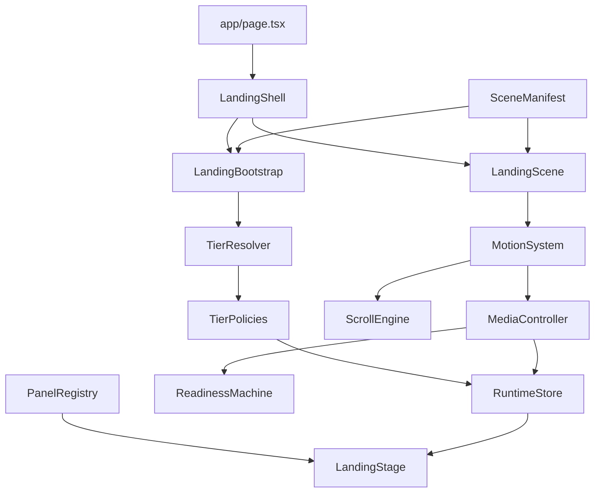

# Landing Architecture Overview

## Goal

Phase 1 replaces the old component-driven landing foundation with a manifest-driven runtime skeleton.

The active landing path is now:

- `app/page.tsx`
- `components/landing/LandingShell.tsx`
- `components/landing/LandingScene.tsx`
- `components/landing/LandingStage.tsx`
- `lib/landing/runtime/landingBootstrap.ts`

The old `components/homepage` and `components/sections` stack is no longer the active route foundation.

## New Module Map

### `lib/landing/core`

- `contracts.ts`
  Shared foundation types for media mode, readiness states, panel keys, preload hints, and warmup hints.
- `assert.ts`
  Small runtime invariant helper for future phases.

### `lib/landing/scenes`

- `sceneTypes.ts`
  Typed contract for landing segments and the scene manifest.
- `sceneManifest.ts`
  Declarative source of truth for segment order, lengths, media mapping, preload rules, warmup hints, tier compatibility, panel keys, and text choreography hooks.
- `sceneChoreography.ts`
  Helpers for declarative text cue generation.
- `sceneSelectors.ts`
  Selectors for critical segments, active segment lookup, visible neighbor windows, and warmup target resolution.

### `lib/landing/tier`

- `tierTypes.ts`
  Strict tier and policy types.
- `tierResolver.ts`
  Conservative runtime tier selection based on viewport, motion preference, connection, and hardware hints.
- `tierPolicies.ts`
  Mapping from tier snapshot to media policy, motion policy, and performance budget.

### `lib/landing/media`

- `mediaManifest.ts`
  Adapter around the existing asset inventory. It keeps the old media catalog as the source for raw URLs while moving orchestration into the new pipeline.
- `mediaPolicy.ts`
  Resolves effective media behavior per tier and produces preload requests from the manifest.
- `readinessMachine.ts`
  Explicit readiness state transitions and target checks.
- `mediaController.ts`
  Central media pipeline for one active video surface, poster fallback, critical preload, and segment-driven playback updates.

### `lib/landing/runtime`

- `runtimeTypes.ts`
  Typed runtime state shape.
- `runtimeStore.ts`
  External store with coarse-grained snapshot access for React.
- `motionSystem.ts`
  Central motion integration that wraps the low-level scroll engine, routes progress into media/runtime callbacks, and owns segment-triggered warmup.
- `landingBootstrap.ts`
  Bootstraps tier resolution, policy setup, critical media priming, motion mounting, and stage attachment.

### `components/landing`

- `LandingShell.tsx`
  Route-scoped orchestration shell.
- `LandingScene.tsx`
  Mounts the scroll scene root and attaches the stage to the runtime bootstrap.
- `LandingStage.tsx`
  Renders the sticky media layer and consumes coarse runtime snapshots. Panel residency is driven by `motionPolicy.mountStrategy`.
- `LandingPreloader.tsx`
  Minimal route-scoped preloader for phase 1.
- `panels/LandingSurface.tsx`
  Lightweight surface wrapper for panels.
- `panels/panelRegistry.tsx`
  Panel registry that maps declarative `panelKey` values to UI components.

## Data Flow

## Landing Bootstrap Process

Bootstrap now lives in `lib/landing/runtime/landingBootstrap.ts` and runs in this order:

1. create the external runtime store
2. resolve the tier snapshot through `tierResolver.ts`
3. map the tier into `mediaPolicy`, `motionPolicy`, and `performanceBudget`
4. write the coarse runtime snapshot into the store
5. prime critical media through `mediaController.ts`
6. mount the scene and attach the single motion system

The shell triggers bootstrap initialization, but the bootstrap owns subsystem setup.

## Scene Manifest Contract

Each segment in `lib/landing/scenes/sceneManifest.ts` declares:

- `id`
- `lengthVh`
- `media.assetId`
- `media.posterAssetId`
- `media.mode`
- `preloadHint`
- `warmupHint`
- `tierCompatibility`
- `textChoreography`
- `panelKey`
- `theme`
- `motionPreset`

This replaces the old pattern where segment timing, media choice, preload behavior, and panel JSX were mixed inside `components/sections/scrollStorySegments.tsx`.

Panel sequencing now comes from the manifest plus the panel registry. React renders panel components selected by `panelKey`; it does not define the sequence itself.

## Runtime Store Contract

The external runtime store keeps only coarse-grained state:

- `tierSnapshot`
- `performanceBudget`
- `mediaPolicy`
- `motionPolicy`
- `readiness`
- `motion.activeSegmentId`
- `motion.documentProgress`
- `media.activeAssetId`
- `media.activePosterSrc`
- `media.assetReadiness`

Hot path motion and media updates stay imperative inside the motion and media systems instead of flowing through React context.
React subscribes through `useSyncExternalStore` selectors and does not receive frame telemetry state.

## Motion System

Phase 1 keeps the low-level idea of `lib/landing/runtime/scrollEngine.ts` but removes component-level ownership of scroll state.

The motion system now:

- mounts exactly one scroll registration for the landing scene
- writes document progress into the external store
- swaps active segment imperatively
- feeds scrub progress directly into the media controller
- triggers manifest-defined warmup targets from the runtime layer
- keeps React out of frame-by-frame progress handling

The active runtime uses exactly one scroll engine instance through `motionSystem.ts` wrapping `scrollEngine.ts`.

## Media Pipeline

The media controller is the new single media orchestrator for the landing stage.

Responsibilities:

- select the effective media mode from tier policy
- keep a stable active asset identity
- avoid resetting `video.src` unless the source actually changes
- preload critical assets from manifest hints
- warm adjacent assets from manifest warmup hints
- report explicit readiness states

The landing shell no longer decides when media warms; warmup decisions are executed inside the runtime/motion/media stack.

## Tier Resolution Flow

Tier resolution is independent from React:

1. `tierResolver.ts` reads viewport and platform hints
2. it emits a conservative `tierSnapshot`
3. `tierPolicies.ts` maps that snapshot into media, motion, and budget policies
4. `landingBootstrap.ts` stores those policies in the external runtime store
5. React reads the resulting coarse snapshot through selectors only

## Media Orchestration Flow

Media orchestration now flows like this:

1. `sceneManifest.ts` declares asset ids, media modes, preload hints, and warmup hints
2. `mediaPolicy.ts` resolves effective media behavior for the current tier
3. `mediaController.ts` chooses poster vs video behavior and keeps the active media identity stable
4. `readinessMachine.ts` upgrades readiness state explicitly
5. `LandingStage.tsx` only reflects the current media snapshot from the store

Phase 1 still leaves room for future work such as standby pools, deeper asset reuse guarantees, and stricter failure UI.

## Tier System

Supported runtime tiers:

- `tier-0-poster`
- `tier-1-hold`
- `tier-2-balanced`
- `tier-3-premium`

Each tier maps to:

- media policy
- motion policy
- performance budget

The resolver is conservative by default and promotes only when viewport and hardware hints justify it.
Tier resolution happens once during bootstrap and is then exposed through the runtime store.

## Route-Scoped Isolation

The root layout no longer injects landing-specific media preloads or SVG displacement filters.

Global styling has been reduced back to a neutral body background, while landing-specific visuals are now route-scoped inside `components/landing/LandingShell.module.css`.

## Legacy Status

Legacy modules are tracked in `_legacy/landing/README.md`.

Removed stacks:

- `components/homepage/*`
- `components/sections/*`
- `components/motion/ScrollScene.tsx`
- `components/ScrollIndicators.tsx`
- `components/ScrollScrubVideoSection.tsx`
- `components/debug/LandingPerfOverlay.tsx`
- `lib/landing/assetStore.ts`
- `lib/landing/preloadPolicy.ts`
- `lib/landing/runtime/capabilityProfile.ts`
- `lib/landing/runtime/effectsPolicy.ts`
- `lib/landingMedia.ts`

The shared `components/ui/Glass.tsx` component has also been detached from the old landing runtime provider so shared UI no longer imports legacy landing context.

## Remaining Integration Points

These are intentionally left for later phases:

- richer scroll choreography and tighter scene windowing
- standby media pool and stronger reuse across adjacent shared assets
- tier-approved unlock rules based on stricter first-frame guarantees
- replacing old RSVP input surfaces with a lighter landing-native control system
- complete retirement or deletion of old delivery APIs and other phase 0 leftovers
- final glass system rebuild and premium-only polish
