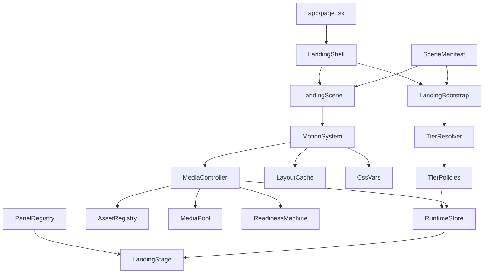
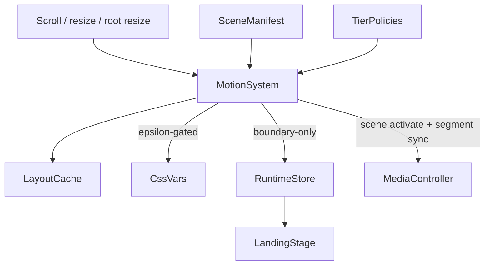
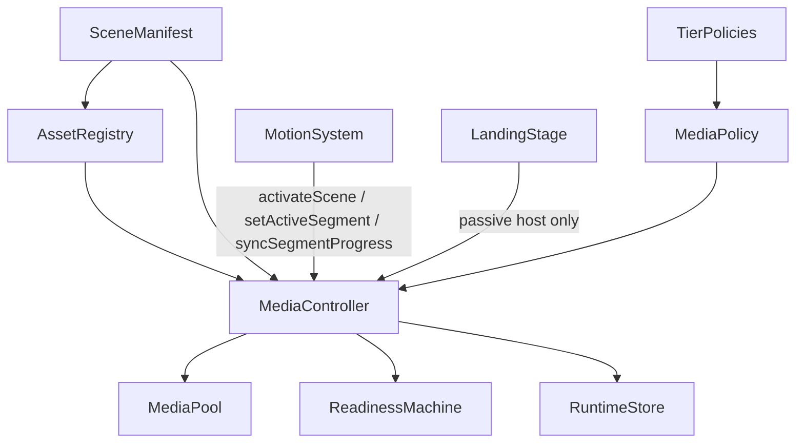

# Landing Architecture Overview

## Goal

Phase 1 replaced the old component-driven landing foundation with a manifest-driven runtime skeleton.
Phase 2 established the deterministic motion engine.
Phase 3 adds the production media runtime that now integrates with that motion stack without moving playback control into React.

The active landing path is now:

- `app/page.tsx`
- `components/landing/LandingShell.tsx`
- `components/landing/LandingScene.tsx`
- `components/landing/LandingStage.tsx`
- `lib/landing/runtime/landingBootstrap.ts`

The old `components/homepage` and `components/sections` stack is no longer the active route foundation.

## New Module Map

### `lib/landing/core`

- `contracts.ts`
  Shared foundation types for media mode, readiness states, panel keys, preload hints, and warmup hints.
- `assert.ts`
  Small runtime invariant helper for future phases.

### `lib/landing/scenes`

- `sceneTypes.ts`
  Typed contract for landing segments and the scene manifest.
- `sceneManifest.ts`
  Declarative source of truth for segment order, lengths, media mapping, preload rules, warmup hints, tier compatibility, panel keys, and text choreography hooks.
- `sceneChoreography.ts`
  Helpers for declarative text cue generation.
- `sceneSelectors.ts`
  Selectors for critical segments, active segment lookup, visible neighbor windows, and warmup target resolution.

### `lib/landing/tier`

- `tierTypes.ts`
  Strict tier and policy types.
- `tierResolver.ts`
  Conservative runtime tier selection based on viewport, motion preference, connection, and hardware hints.
- `tierPolicies.ts`
  Mapping from tier snapshot to media policy, motion policy, and performance budget.

### `lib/landing/media`

- `assetRegistry.ts`
  Resolves manifest asset ids into concrete desktop/mobile media records, effective media modes, preload targets, and warmup targets.
- `mediaPolicy.ts`
  Resolves effective media behavior per tier, preload targets, standby eligibility, and scrub throttling settings.
- `mediaPool.ts`
  Manages active and standby video planes so the controller can reuse media elements and limit decoder churn.
- `readinessMachine.ts`
  Explicit readiness state transitions, comparisons, and unlock checks.
- `mediaController.ts`
  Central media pipeline for critical preload, incremental warmup, pooled video lifecycle ownership, poster fallback, and deterministic segment-driven playback updates.
- `mediaManifest.ts`
  Legacy adapter around the canonical asset inventory retained for compatibility during the rebuild.

### `lib/landing/runtime`

- `runtimeTypes.ts`
  Typed runtime state shape.
- `runtimeStore.ts`
  External store with coarse-grained snapshot access for React.
- `progressMath.ts`
  Pure helper utilities for manifest range normalization and clamped progress math.
- `sceneRegistry.ts`
  Pure scene measurement/progress helper layer retained for non-owning runtime math reuse.
- `motionSystem.ts`
  The single production motion runtime. It owns passive scroll scheduling, `requestAnimationFrame`, resize invalidation, hysteresis-protected segment activation, CSS variable writes, and delegated media synchronization.
- `landingBootstrap.ts`
  Bootstraps tier resolution, policy setup, critical media priming, motion mounting, and stage attachment.

### `components/landing`

- `LandingShell.tsx`
  Route-scoped orchestration shell.
- `LandingScene.tsx`
  Mounts the scroll scene root and attaches the stage to the runtime bootstrap.
- `LandingStage.tsx`
  Renders the sticky poster layer plus a passive media host while consuming coarse runtime snapshots. Panel residency is driven by `motionPolicy.mountStrategy`.
- `LandingPreloader.tsx`
  Minimal route-scoped preloader for phase 1.
- `panels/LandingSurface.tsx`
  Lightweight surface wrapper for panels.
- `panels/panelRegistry.tsx`
  Panel registry that maps declarative `panelKey` values to UI components.

## Data Flow

## Landing Bootstrap Process

Bootstrap now lives in `lib/landing/runtime/landingBootstrap.ts` and runs in this order:

1. create the external runtime store
2. resolve the tier snapshot through `tierResolver.ts`
3. map the tier into `mediaPolicy`, `motionPolicy`, and `performanceBudget`
4. write the coarse runtime snapshot into the store
5. resolve the initial manifest segment and activate it inside the media controller
6. prime critical media through `mediaController.ts`
7. queue adjacent warmups for the initial reveal
8. mount the scene and attach the motion system plus passive media host

The shell triggers bootstrap initialization, but the bootstrap owns subsystem setup.

## Scene Manifest Contract

Each segment in `lib/landing/scenes/sceneManifest.ts` declares:

- `id`
- `lengthVh`
- `media.assetId`
- `media.posterAssetId`
- `media.mode`
- `preloadHint`
- `warmupHint`
- `tierCompatibility`
- `textChoreography`
- `panelKey`
- `theme`
- `motionPreset`

This replaces the old pattern where segment timing, media choice, preload behavior, and panel JSX were mixed inside `components/sections/scrollStorySegments.tsx`.

Panel sequencing now comes from the manifest plus the panel registry. React renders panel components selected by `panelKey`; it does not define the sequence itself.

## Runtime Store Contract

The external runtime store keeps only coarse-grained state:

- `tierSnapshot`
- `performanceBudget`
- `mediaPolicy`
- `motionPolicy`
- `readiness`
- `motion.activeSceneId`
- `motion.activeSegmentId`
- `media.activeAssetId`
- `media.activePosterSrc`
- `media.assetReadiness`

Hot path motion and media updates stay imperative inside the motion and media systems instead of flowing through React context.
React subscribes through `useSyncExternalStore` selectors and does not receive frame telemetry state, live document progress, or per-segment motion progress.

## Motion System

The motion system now:

- owns the only passive scroll listener and the only `requestAnimationFrame` queue
- measures layout only on invalidation through resize, orientation, and root resize signals
- computes document, scene, and segment progress from manifest ranges and cached layout
- uses hysteresis to stabilize active segment switching at scene boundaries
- writes root and active-window segment CSS variables imperatively with epsilon-gated updates
- updates the runtime store only for scene and segment boundary changes
- feeds tier-approved scrub progress directly into the media controller
- triggers manifest-defined warmup targets from the runtime layer only on boundary changes
- keeps React out of frame-by-frame progress handling

`scrollEngine.ts` is no longer a runtime owner. The motion kernel now lives directly in `motionSystem.ts`.

## Motion Flow

## Scene Activation Model

The engine keeps its own mutable scene and segment state outside React.

Per frame, it:

1. reads the current scroll position
2. remeasures cached boundaries only if layout is dirty
3. computes normalized scene progress from the manifest-defined scroll span
4. resolves the active segment with hysteresis instead of switching exactly on raw boundaries
5. writes CSS variables only for the active segment and the near-active mount window
6. emits coarse store updates only when scene or segment boundaries actually change

Resize and orientation invalidation trigger a full recompute and resync of:

- scene activation
- active segment selection
- CSS custom properties
- delegated media progress

## Media Pipeline

The media controller is the new single media orchestrator for the landing stage.

Responsibilities:

- own all `HTMLMediaElement` instances
- resolve the effective media mode from tier policy and manifest metadata
- keep a stable active asset identity and poster identity
- avoid resetting `video.src` unless the resolved asset actually changes
- preload critical assets from manifest hints and unlock only when required readiness is satisfied
- warm adjacent and deferred assets incrementally under budget limits
- reuse active and standby video planes through `mediaPool.ts`
- report explicit readiness states and degrade to hold or poster on failure

The landing shell no longer decides when media warms; warmup decisions are executed inside the runtime/motion/media stack.

## Media Runtime Architecture

`mediaController.ts` is now the only runtime owner of media elements and playback state. React renders a passive host container in `LandingStage.tsx`, but the controller creates, mounts, reuses, and tears down video nodes independently from the React lifecycle.

`assetRegistry.ts` is the bridge from `sceneManifest.ts` to concrete media delivery. It resolves:

- active asset id
- poster asset id
- effective media mode after tier rules
- preload target readiness
- warmup targets
- concrete desktop/mobile sources from `lib/landing/mediaManifest.ts`

`mediaPool.ts` maintains a small number of reusable video planes:

- one active plane for the currently visible cinematic asset
- an optional standby plane for near-future warmups on higher tiers
- bounded reuse based on `standbyPoolSize` and `maxActiveVideos`

`readinessMachine.ts` remains the canonical readiness ladder:

- `idle`
- `poster-ready`
- `metadata-ready`
- `first-frame-ready`
- `playable`
- `failed`

Bootstrap and preloader logic now rely on these explicit states instead of incidental component timing.

## Tier Resolution Flow

Tier resolution is independent from React:

1. `tierResolver.ts` reads viewport and platform hints
2. it emits a conservative `tierSnapshot`
3. `tierPolicies.ts` maps that snapshot into media, motion, and budget policies
4. `landingBootstrap.ts` stores those policies in the external runtime store
5. React reads the resulting coarse snapshot through selectors only

## Media Orchestration Flow

Media orchestration now flows like this:

1. `sceneManifest.ts` declares asset ids, media modes, preload hints, and warmup hints
2. `assetRegistry.ts` resolves the manifest requirements into concrete asset records for the current device profile
3. `mediaPolicy.ts` resolves effective media behavior for the current tier, including scrub throttling and warmup targets
4. `motionSystem.ts` activates scenes and segments and forwards tier-approved scrub progress without touching media elements directly
5. `mediaController.ts` selects the active asset, manages pool reuse, schedules preload work, and drives fallback behavior
6. `readinessMachine.ts` upgrades readiness state explicitly and guards bootstrap unlock
7. `LandingStage.tsx` only reflects the coarse media snapshot from the store while hosting controller-owned media nodes

## Asset Lifecycle

Every cinematic asset now follows this lifecycle:

1. manifest declaration through `sceneManifest.ts`
2. asset resolution in `assetRegistry.ts`
3. critical, warmup, or deferred preload scheduling in `mediaController.ts`
4. readiness promotion through `readinessMachine.ts`
5. active or standby plane assignment in `mediaPool.ts`
6. playback mode application in `mediaController.ts`
7. downgrade to hold or poster if decode, autoplay, or network behavior is not acceptable

The preloader now unlocks only when the critical asset set required by the current tier satisfies `readiness.unlockTarget`. On premium and balanced tiers that means first-frame readiness; lower tiers use the stricter fallback target defined by tier policy.

## Scrub Synchronization Model

Scrub playback remains delegated from the motion engine through:

- `activateScene(sceneId)`
- `setActiveSegment(segment)`
- `syncSegmentProgress(sceneId, progress)`

The motion system still owns all scroll activation and progress math. The media controller only consumes those signals and applies them to the active plane.

Scrub safeguards now include:

- progress epsilon checks before accepting a new scrub target
- minimum seek intervals per tier
- current-time epsilon checks before mutating the media element
- `requestVideoFrameCallback` pacing when available
- decode-lag detection with fallback to `hold`
- poster fallback on hard media failure

This keeps scroll scrubbing deterministic while preventing seek storms on mid-tier devices.

## Tier Media Behavior

The media runtime now follows these tier rules:

- `tier-3-premium`: full scrub, first-frame critical unlock, active plus standby pool, aggressive warmup
- `tier-2-balanced`: scrub with stronger throttling, first-frame critical unlock, single active plane, adjacent warmup
- `tier-1-hold`: no scrub, hold-mode video, metadata readiness target, no standby pool
- `tier-0-poster`: poster-only rendering, poster readiness target, no video planes, no warmup

Tier policy still lives in `tierPolicies.ts`, but Phase 3 now enforces more of those constraints in the live media runtime rather than treating them as declarative only.

## Performance Safeguards

The Phase 3 media runtime is designed to stay off the React hot path and protect decode/network budgets:

- React no longer owns or controls the landing video nodes
- source changes are skipped when the resolved asset is unchanged
- active and standby planes are reused instead of recreated during scroll
- preload work is bounded by `maxConcurrentPreloads`
- active media residency is bounded by `maxActiveVideos`
- warmups are incremental and triggered from runtime boundaries rather than from component renders
- scrub seeks are throttled and coalesced before writing `currentTime`
- fallback to hold/poster prevents unstable decode loops from stalling the scene runtime

## Phase 3 Implementation Report

### Media Runtime Architecture

Phase 3 keeps `motionSystem.ts` as the sole animation owner and inserts a stronger media runtime behind the existing controller contract. `mediaController.ts` now coordinates `assetRegistry.ts`, `mediaPool.ts`, `mediaPolicy.ts`, and `readinessMachine.ts` while `LandingStage.tsx` only supplies a passive host container.

### Media Lifecycle

Assets start in the manifest, resolve to device-specific media records, advance through explicit readiness states, and are then mounted onto active or standby pooled planes. On activation they enter loop, hold, scrub, or poster mode depending on tier and manifest rules. On failure they degrade to poster mode instead of forcing React or motion to compensate.

### Scrub Synchronization

Scroll progress still originates exclusively from `motionSystem.ts`. The media controller coalesces those progress updates, ignores tiny deltas, limits seek cadence, and uses `requestVideoFrameCallback` when available so decode progress can keep up with scrolling. If decode lag becomes unstable, the runtime falls back to hold mode for the active segment.

### Tier Behavior

Premium tiers keep full scrub behavior and optional standby warmups. Balanced tiers keep scrub but under tighter seek/decode budgets. Hold tiers preserve cinematic video without frame-linked scrubbing. Poster tiers avoid video entirely and still satisfy the manifest and preloader pipeline deterministically.

### Performance Safeguards

The runtime avoids unnecessary allocations, DOM churn, and repeated video reloads by reusing pooled planes, gating preloads by concurrency, and skipping meaningless media writes. This keeps the landing deterministic across device tiers without reintroducing React into the animation or media hot path.

## Tier System

Supported runtime tiers:

- `tier-0-poster`
- `tier-1-hold`
- `tier-2-balanced`
- `tier-3-premium`

Each tier maps to:

- media policy
- motion policy
- performance budget

The resolver is conservative by default and promotes only when viewport and hardware hints justify it.
Tier resolution happens once during bootstrap and is then exposed through the runtime store.

## Route-Scoped Isolation

The root layout no longer injects landing-specific media preloads or SVG displacement filters.

Global styling has been reduced back to a neutral body background, while landing-specific visuals are now route-scoped inside `components/landing/LandingShell.module.css`.

## Legacy Status

Legacy modules are tracked in `_legacy/landing/README.md`.

Removed stacks:

- `components/homepage/*`
- `components/sections/*`
- `components/motion/ScrollScene.tsx`
- `components/ScrollIndicators.tsx`
- `components/ScrollScrubVideoSection.tsx`
- `components/debug/LandingPerfOverlay.tsx`
- `lib/landing/assetStore.ts`
- `lib/landing/preloadPolicy.ts`
- `lib/landing/runtime/capabilityProfile.ts`
- `lib/landing/runtime/effectsPolicy.ts`
- `lib/landingMedia.ts`

The shared `components/ui/Glass.tsx` component has also been detached from the old landing runtime provider so shared UI no longer imports legacy landing context.

## Remaining Integration Points

These are intentionally left for later phases:

- richer scroll choreography and tighter scene windowing
- replacing old RSVP input surfaces with a lighter landing-native control system
- complete retirement or deletion of old delivery APIs and other phase 0 leftovers
- final glass system rebuild and premium-only polish
